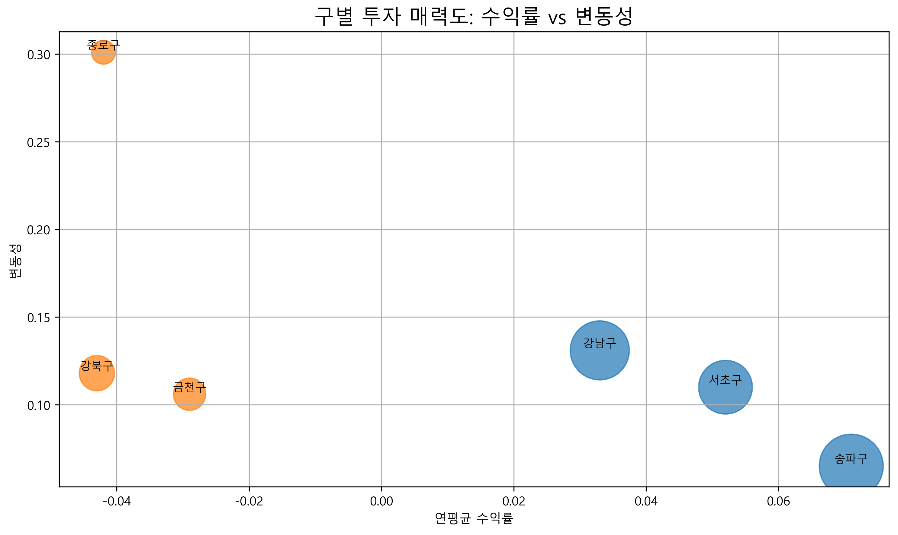
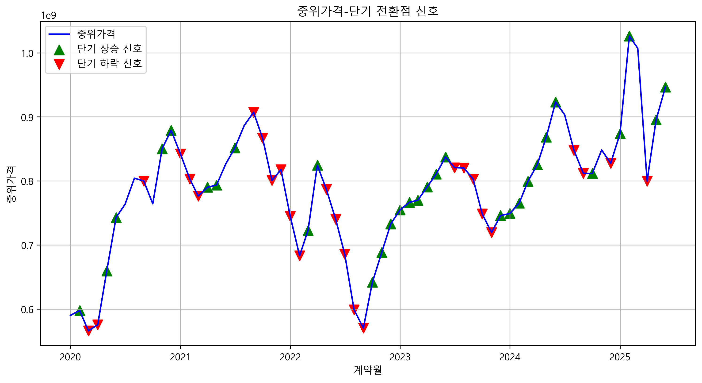

# 서울 부동산 시장 분석 및 투자 전략 수립

## 개요
본 프로젝트는 **국토교통부 실거래가 공개시스템**에서 제공하는 서울시 아파트 매매 데이터를 기반으로  
최근 5년간(2020년 1월 ~ 2025년 6월) 부동산 시장 동향을 분석하고, 금리 및 정부 정책 변화가 시장에 미치는 영향을 탐구하는 것을 목표로 함.

## 프로젝트 주제
- 서울 아파트 매매 데이터를 활용한 시장 분석
- 금리 및 정부 정책 변화가 거래 및 가격에 미치는 영향 탐색
- 투자자 및 정책 입안자에게 유용한 시사점 도출

## 데이터 처리

### 데이터 출처
- [아파트 실거래가(매매) 데이터](https://rt.molit.go.kr/pt/xls/xls.do?mobileAt=) / 서울, 2020.01 ~ 2025.06
- [서울시 등록인구(월별) 통계](https://data.seoul.go.kr/dataList/11067/S/2/datasetView.do) / 전 구에 대해, 2020.01 ~ 2025.06
- [대한민국 시장금리 추이](https://www.index.go.kr/unity/potal/main/EachDtlPageDetail.do?idx_cd=1073) / 2020.01 ~ 2025.06
- [소비자물가지수 통계](https://kosis.kr/statHtml/statHtml.do?sso=ok&returnurl=https%3A%2F%2Fkosis.kr%3A443%2FstatHtml%2FstatHtml.do%3Flist_id%3DP2_6%26obj_var_id%3D%26seqNo%3D%26tblId%3DDT_1J22003%26vw_cd%3DMT_ZTITLE%26orgId%3D101%26path%3D%252FstatisticsList%252FstatisticsListIndex.do%26conn_path%3DMT_ZTITLE%26itm_id%3D%26lang_mode%3Dko%26scrId%3D%26) / 2020.01 ~ 2025.06

### 전처리

- 아파트 실거래가(매매) 데이터

    1. 필요한 데이터만 추출
        - 실제 사용할 데이터인 시군구, 전용면적, 계약년월, 계약일, 거래금액, 매수자, 매도자, 건축년도, 해제사유발생일 컬럼만 남기고 제거

    2. 데이터 가공
        - 계약년월에는 계약이 일어난 년-월 데이터가, 계약일에 계약이 일어난 날짜 데이터가 저장되어 있으므로 두 데이터를 합쳐 계약일로 정의
        - 거래금액의 경우, 통화 형식으로 저장되고, 단위가 만원이므로 이를 숫자 형식으로, 단위는 원으로 변경
        - 전부 서울시 데이터이므로 시군구 컬럼에서 시 데이터를 삭제하고, 구와 동으로 분리함
        - **대한민국 소비자물가지수 데이터**를 이용해 거래금액을 실질금액으로 변경.
        - 전용면적(㎡)과 실질금액을 이용해 각 매물의 평단가를 계산함

    3. 이상치/결측치 확인
        - 해제사유발생일 컬럼에 값이 있다면 그 날짜에 거래가 취소처리된 경우이므로, 데이터에서 삭제함
        - 2024년 이후 데이터부터는 매수자가 공공기관인 경우, 대부분 임대주택을 위해 공공기관이 구매한 데이터이므로 분석 취지와 맞지 않아 제거함
        - 2023년 이전 데이터에는 매수자와 매도자가 전부 공란처리되어있어, 같은 날짜에 같은 단지에서 20건 이상 거래가 발생한 경우를 임대주택이라고 의심하고 제거함
        - 부동산 데이터이므로, 이상치를 찾는 게 제한되어 일반적으로 거래금액일 수 없는 값인 경우만 제거하여 이상치를 처리함
        - 결측치는 전부 그 행 전체를 삭제처리

- 나머지 데이터는 데이터 양이 적어 직접 눈으로 결측치/이상치 없는 걸 확인

## 주요 과제

### 과제 1. 시장 구조 비교

**목표**

- 서울시 내 인기구 vs 비인기구 거래량·가격 비교 분석
- 거래 밀도, 평균 거래가, 변동성 지표 등을 활용

**분석 결과**

1. 시장 구조 차이
    - 인기구: 거래액·가격 압도적, 초고가 거래 존재, 거래량 많음.
    - 비인기구: 낮은 거래가·거래량, 유동성 부족, 수익률 마이너스 지속.

2. 시계열 트렌드
    - 인기구: 하락기 이후 빠른 회복 → 회복 탄력성 강함.
    - 비인기구: 하락 후 제자리 → 시장 반등 효과 제한적.

3. 투자 매력도
    - 인기구: 플러스 수익률 → 위험 대비 수익 합리적.
    - 비인기구: 수익률 마이너스, 변동성 차별화 없음 → 리스크 대비 보상 낮음.

4. 전략적 시사점
    - 인기구: 투자에 유리, 유동성과 가격 변동성 활용 가능.
    - 비인기구: 개발호재 없이는 투자 매력 낮음.

### 과제 2: 아파트 규모별 가격 트렌드 및 생애주기 투자 전략

**목표**

- 전용면적별(소형, 중형, 대형) 아파트의 가격 변동 추이를 분석
- 생애주기와 데이터 분석에 따른 최적 투자 전략 및 거주 전략을 제시

**분석 결과**

#### 전용면적별 가격 변동 추이

1. 거래 유동성/가격 구조와 투자 위험

    - 소형·중형은 거래량이 많아 매도·매수 유동성이 높음 → 단기 투자에 유리.
    - 소형은 단가가 낮고 하락기 방어력이 강해 안정적 투자처.

    - 대형은 거래량이 적어 환금성 리스크 존재 → 장기 보유 투자에 적합.
    - 대형은 단가 우위가 있으나 시장 충격 시 낙폭이 커 "하이리스크·하이리턴" 구조.

1. 수요 구조 변화
    - 소형에서 신축 비율이 높은 것은 젊은 세대의 수요 집중을 반영 → 인구 구조 변화에 따라 장기적으로 소형 신축은 안정적 수요 기반 확보 가능.
    - 반면 대형은 신축 비율이 낮고 노후 주택 비중이 커, 리모델링·재건축 규제와 정책에 더 큰 영향을 받음.

2. 전략적 시사점
    - 단기 회전형 투자 → 소형·중형 중심.
    - 장기 자산 가치 투자 → 대형이나 재건축 가능성이 있는 노후 대형.
    - 정책 변수(재건축 규제, 공급 확대 등)에 민감하게 반응 → 대형 위주 모니터링 필요.

#### 최적의 투자 및 거주 전략

- 청년기: 거주/투자 모두 소형 아파트의 점수가 높게 나온 것을 볼 수 있다.
- 중년기: 거주는 중형, 투자는 대형 아파트에 하는 것이 가장 점수가 높다.
- 노년기: 거주는 소형, 투자는 대형 아파트에 하는 것이 좋다는 것을 볼 수 있다.

    | 생애주기 | 전략 | 소형  | 중형  | 대형  | 선택 |
    |---------|------|-------|-------|-------|------|
    | 청년     | 거주 | 2.51  | 0.81  | -3.32 | 소형 |
    |          | 투자 | 0.77  | -0.13 | -0.64 | 소형 |
    | 중년     | 거주 | 0.55  | 0.64  | -1.19 | 중형 |
    |          | 투자 | -1.19 | -0.31 | 1.49  | 대형 |
    | 노년     | 거주 | 1.8   | -0.3  | -1.51 | 소형 |
    |          | 투자 | 0.07  | -1.24 | 1.17  | 대형 |

### 과제 3. 부동산 거래량과 가격의 선행지표 관계 분석

**목표**

- 부동산 거래량 변화가 가격 변동에 미치는 영향을 시차 분석을 통해 파악
- 시장 전환점을 예측할 수 있는 지표 개발

**분석 결과**

중위가격과 거래량의 변화율이 모두 임계값보다 높거나 낮을 때를 신호로 추출하였음. 임계값은 60%일 때 가장 좋은 F1 Score를 보였다.

1. 거래량 변화율은 중위가격 변화율과 단기(0~1개월)에서만 높은 상관관계.
    - 가격과 거래량이 동행하므로, 현재 거래량 급증은 단기적으로 가격 변동성과 맞물려 움직일 가능성이 큼.
    - 따라서 단기 매매 시 거래량 급증 구간은 가격 변동 리스크 구간으로 인식 필요.

2. Granger Test 결과, 거래량 변화율은 4~10개월 후 중위가격 변화를 설명할 수 있음.
    - 거래량 회복은 향후 가격 상승 신호로, 거래량 위축은 향후 가격 하락 신호로 해석 가능.
    - 따라서 거래량을 중기 투자 전략의 핵심 선행지표로 활용 가능.

3. 거래량 선행 지표화: 매입 시점 판단에서 가격 신호보다 거래량 추세를 우선 관찰.
    - 위험 관리: 거래량 급락 국면에서는 가격이 아직 안정적이어도 6~10개월 내 하락 위험 반영.
    - 기회 포착: 거래량 반등 초기 국면은 가격 상승 국면 진입 전 저가 매수 기회로 활용 가능

### 자유 주제 연구: 금리 및 정부 부동산 정책 변화가 서울 부동산 시장에 미치는 영향

#### 금리 변화의 영향

**목표**

- 금리가 서울 부동산 시장에 미치는 영향 분석
- 금리 데이터 활용 시계열 분석
- 투자자 및 정책 입안자 대상 실무 인사이트 도출

**분석 결과**

1. 전체적인 상관관계는 낮음
   - 기준금리와 국고채금리 모두 부동산 지표와 강한 단기 상관성을 보이지 않음.
   
2. 선행 가능성
   - 국고채금리 기준, 중위가격, 월평균거래금액, 평균평단가 등 가격 지표에 선행 가능성 확인
   - 변동성(시장 안정성)에도 선행 가능성 있음
   해석: 국고채금리는 변동성 및 가격 지표에 선행성이 있어, 투자 전략 수립 시 더 직접적 참고 가능

3. 금리 차이
    - 기준금리는 한은이 직접 결정한 정책금리, 국고채금리는 시장에서 형성된 금리
    - 기준금리는 정책 신호의 역할을 하고, 국고채금리는 시장 기대의 신호라고 볼 수 있음

4. 투자 및 리스크 관리 전략
    - 국고채금리 상승 → 5~11개월 후 아파트 가격 상승 가능성 → 장기 투자 판단 참고
    - 금리 변화가 가격에 즉시 반영되지 않으므로, 단기 매매보다는 장기적 안정성 확보 중심

#### 정부 정책의 효과

**목표**

- 정부 부동산 정책 변화가 서울 부동산 시장에 미치는 영향 분석
- 정책 시행 이벤트 더미 활용 시계열 분석
- 투자자 및 정책 입안자 대상 실무 인사이트 도출

**분석 결과**

1. 거래량 분석
    - 규제 강화: 거래량 감소가 즉시 나타나지만 장기적 안정은 보장되지 않음
        - 단기 매수 회피, 기존 보유 포지션 점검 필요
    - 주택 공급 정책: 단기 효과가 제한적, 장기적 정책 효과 발생
        - 장기 투자지역 선점
    - 시장 활성화 정책: 즉시 거래량 확대
        - 발표 직후 매수 기회, 거래 활성화 구간을 활용하기

2. 거래가격 변화 분석
    - 거래량 변화와 가격 변화가 항상 일치하지 않음. 
        - 규제 정책은 거래량 감소, 가격 상승 경향.
        - 주택 공급 정책, 시장 활성화 정책은 가격 상승과 거래량 증가를 동시에 유도.
            - 가격 상승단기, 중장기 모두 투자 기회

3. 변동성 분석
    - 규제 강화: 변동성 급등 → 거래량 감소 후 가격 변동 확대.
        - 단기 매수 매우 위험함

4. 전략적 시사점
    정책 간 상호작용 중요: 누적/연속 정책 존재 → 단일 정책 효과만 보는 분석은 과대평가 위험

## 기대 효과

- 서울 아파트 시장의 구조적 특징과 단기·중기 가격·거래 변동성 이해  
- 금리 및 정책 변화에 따른 민감도 평가 및 선행 신호 활용 가능  
- 투자자에게는 매수·매도 타이밍 판단과 생애주기별 맞춤 전략 제시  
- 정책 담당자에게는 공급·규제·활성화 정책의 효과를 실증적으로 점검할 수 있는 근거 제공

## 실제 분석 결과와 비교

1. 과제 1
   - 인기구 집중 · 양극화 심화: 강남3구(강남·서초·송파) 시가총액 비중이 **서울의 43%**로 집계 이래 최고치 달성 ([출처](https://www.hankyung.com/article/2025070351366))

2. 과제 2
    - 소형 아파트의 유동성 · 방어력: 최근 1년간 소형 평형의 상승 탄력이 중형과 비슷하거나 우세했다는 실거래 · 통계 보도 확인 ([출처](https://www.mk.co.kr/news/realestate/11065881))

3. 과제 3
    - 학술 근거: 국내 주택시장에서 거래량이 가격을 선행한다는 그랜저 인과 분석 결과가 다수 존재([출처](https://doi.org/10.1007/s12205-019-1926-9))

4. 자유주제
    - 시장 반응: 정책 직후 가계대출 총량 관리 강화, 일부 은행의 대출 중단·금리 인상, 대환 제한 등으로 거래 관망과 체감 유동성 축소 ([출처](https://marketin.edaily.co.kr/News/ReadE?newsId=04264006642264040))

## 시사점

### 투자자 관점

- 금리 사이클과 거래량 추이를 선행지표로 활용해 단기 변동성 관리 가능  
- 생애주기별 맞춤형 전략 필요: 청년층은 소형, 중년층은 중형·대형, 노년층은 소형 거주·대형 투자 전략이 타당  
- 거래량 반등 초기 국면을 가격 상승 전 매수 기회로 적극 활용 가능  

### 정책적 관점

- 공급 정책: 장기 효과만 있음 → 단기 수요 조절책(세제·대출 규제 완화 등)과 병행
- 규제 강화: 거래량 급감 및 단기 변동성 확대 야기 → 시장 안정 목적일 경우 보완책 필요  
- 금리 ↔ 주택 정책 효과는 상호작용 → 분리된 정책보다는 종합적·누적적 정책 패키지 설계 필요  
- 거래량·가격을 실시간 모니터링하는 지표 체계 구축을 통해 시장 전환점을 조기에 포착 가능  

## 한계와 향후 과제

- 구별 분석은 제외했으나, 확장 가능
- 투자 및 거주전략 제시 시 학군 데이터 등 미시 데이터와 연계해 더 상세한 전략 제시 가능

## 출처
*Lee, K. (2019). Forecasting short-term housing transaction volumes using time-series analysis. Journal of Asian Architecture and Building Engineering, 18(3), 223–234. https://doi.org/10.1007/s12205-019-1926-9*