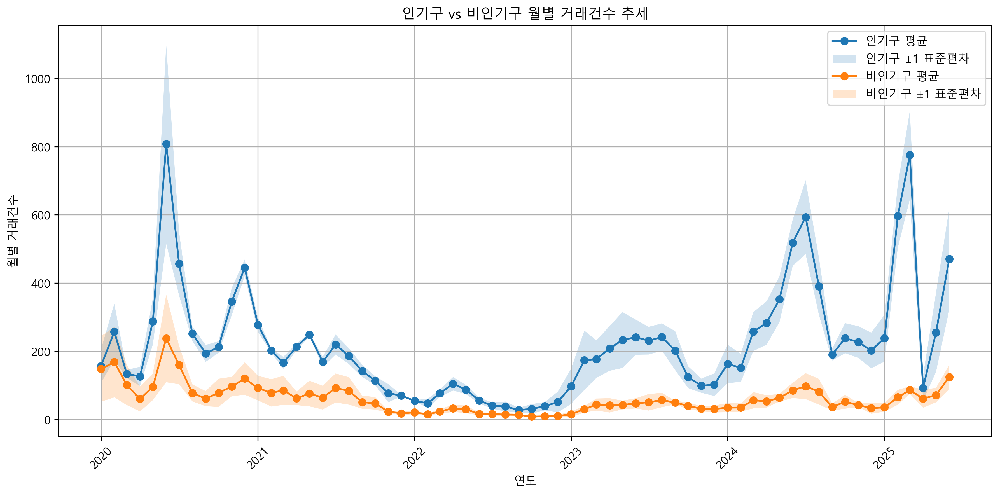
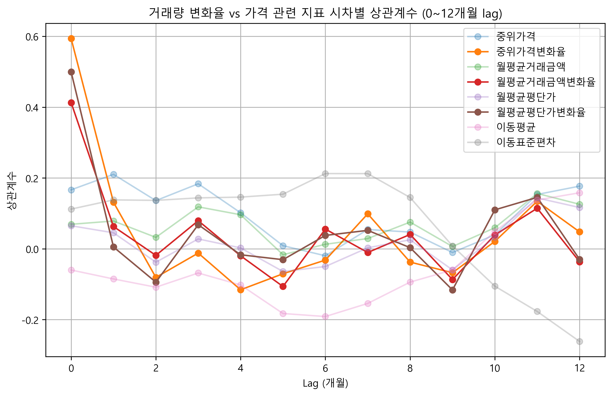

# 서울 부동산 시장 분석 및 투자 전략 수립
- 작성자: 김정수
- 작성날짜: 2025-08-20

## Abstract
본 연구는 서울 부동산 시장을 대상으로 거래량과 가격의 변동 요인을 다각도로 분석하고, 이를 바탕으로 투자 전략을 도출하는 것을 목적으로 한다. 연구는 네 가지 과제를 중심으로 진행되었다. 첫째, 인기구와 비인기구의 주택 시장 특성을 비교하였다. 둘째, 면적 및 생애주기에 따른 거주 및 투자 전략을 제시하였다. 셋째, 거래량과 가격 간의 선행지표 관계를 시차 분석과 인과 검정을 통해 검토하였다. 넷째, 금리와 정부 정책이 시장에 미치는 영향을 이벤트 분석과 통계 검증으로 평가하였다. 분석 결과, 서울시 인기구의 투자 매력도가 비인기구에 비해 현저하게 높고, 거래량 변화는 중위가격 변동의 선행지표 역할을 충분히 수행 가능하며, 금리 및 정책 변수는 단기적으로 강한 영향을 미치나 장기적 효과는 제한적임이 확인되었다. 본 연구는 투자자와 정책 결정자에게 시장의 동학을 이해하고 합리적 의사결정을 내리는 데 기여할 수 있다.

## 서론
서울 부동산 시장은 인구 집중, 공급 제약, 정책 변화 등 다양한 요인이 복합적으로 작용하는 구조적 특성을 가진다. 최근 몇 년간 주택 가격은 급격한 상승과 조정을 반복하며 높은 변동성을 보여 왔으며, 이 과정에서 금리와 정부 정책의 영향력이 부각되었다. 그러나 시장 참여자들이 체감하는 단기적 충격과 장기적 흐름은 반드시 일치하지 않는다.

이에 본 연구는 서울 부동산 시장의 구조와 변동 요인을 실증적으로 분석하고자 한다. 특히, 거래량과 가격의 선행지표 관계를 통해 시장 예측 가능성을 높이고, 금리 및 정책 요인이 다양한 가격 지표에 미치는 파급 효과를 정량적으로 평가한다. 또한 지역 및 주택 특성별 차이를 구분하여 실수요자, 투자자, 정책결정자 모두에게 실질적으로 유용한 전략적 시사점을 도출하고자 한다.

## 데이터

### 데이터 목록

1. 서울시 아파트 실거래가(매매) 데이터
    - 출처: [국토교통부 실거래가 공개시스템](https://rt.molit.go.kr/pt/xls/xls.do?mobileAt=)
    - 기간: 2020년 1월 1일 ~ 2025년 6월 30일

2. 서울시 등록인구(월별) 데이터
    - 출처: [서울시 등록인구(월별) 통계](https://data.seoul.go.kr/dataList/11067/S/2/datasetView.do)
    - 기간: 2020년 1월 ~ 2025년 6월

3. 대한민국 금리 데이터 
    - 출처: [대한민국 시장금리 추이](https://www.index.go.kr/unity/potal/main/EachDtlPageDetail.do?idx_cd=1073)
    - 기간: 2020년 1월 ~ 2025년 6월

4. 대한민국 소비자물가지수 데이터
    - 출처: [소비자물가지수 통계](https://kosis.kr/statHtml/statHtml.do?sso=ok&returnurl=https%3A%2F%2Fkosis.kr%3A443%2FstatHtml%2FstatHtml.do%3Flist_id%3DP2_6%26obj_var_id%3D%26seqNo%3D%26tblId%3DDT_1J22003%26vw_cd%3DMT_ZTITLE%26orgId%3D101%26path%3D%252FstatisticsList%252FstatisticsListIndex.do%26conn_path%3DMT_ZTITLE%26itm_id%3D%26lang_mode%3Dko%26scrId%3D%26)
    - 기간: 2020년 1월 ~ 2025년 6월

### 데이터 전처리

#### 서울시 아파트 실거래가(매매)데이터

1. 필요한 데이터만 추출
   - 실제 사용할 데이터인 시군구, 전용면적, 계약년월, 계약일, 거래금액, 매수자, 매도자, 건축년도, 해제사유발생일 컬럼만 남기고 제거

2. 데이터 가공
   - 계약년월에는 계약이 일어난 년-월 데이터가, 계약일에 계약이 일어난 날짜 데이터가 저장되어 있으므로 두 데이터를 합쳐 계약일로 정의
   - 거래금액의 경우, 통화 형식으로 저장되고, 단위가 만원이므로 이를 숫자 형식으로, 단위는 원으로 변경
   - 전부 서울시 데이터이므로 시군구 컬럼에서 시 데이터를 삭제하고, 구와 동으로 분리함
   - **대한민국 소비자물가지수 데이터**를 이용해 거래금액을 실질금액으로 변경.
   - 전용면적(㎡)과 실질금액을 이용해 각 매물의 평단가를 계산함

3. 이상치/결측치 확인
   - 해제사유발생일 컬럼에 값이 있다면 그 날짜에 거래가 취소처리된 경우이므로, 데이터에서 삭제함
   - 2024년 이후 데이터부터는 매수자가 공공기관인 경우, 대부분 임대주택을 위해 공공기관이 구매한 데이터이므로 분석 취지와 맞지 않아 제거함
   - 2023년 이전 데이터에는 매수자와 매도자가 전부 공란처리되어있어, 같은 날짜에 같은 단지에서 20건 이상 거래가 발생한 경우를 임대주택이라고 의심하고 제거함
   - 부동산 데이터이므로, 이상치를 찾는 게 제한되어 일반적으로 거래금액일 수 없는 값인 경우만 제거하여 이상치를 처리함
   - 결측치는 전부 그 행 전체를 삭제처리

#### 기타 데이터

- 2, 3, 4번 데이터는 데이터 양이 적어 직접 눈으로 결측치/이상치 없는 걸 확인

## 분석 과제

calc_monthly_annual.py
- 분석을 용이하게 하기 위해 데이터프레임을 집계하는 프로그램을 작성
- 받은 데이터프레임에 대해 월별 통계(월별거래량, 월평균거래액, 중위가격, 월평균평단가)와 연간 통계(연간수익률, 변동성), 추세 통계(이동평균, 이동표준편차)를 집계함
- 특정 범주형 변수를 받을 경우, 그 변수에 대해 우선 집계하도록 설계

### 과제1: 서울 인기구 vs 비인기구 부동산 시장 비교 분석

- 목적: 서울시 기준, 인기구와 비인기구를 분류한 뒤 각 가격 변동 패턴을 비교 분석하고, 지역별 시장 특성을 확인해 투자 매력도를 평가한다.
- 사용 데이터: 전처리 완료한 서울시 아파트 실거래가(매매)데이터, 서울시 등록인구(월별) 데이터

1. 인기구와 비인기구 분류 후, 가격 변동 패턴 비교 분석 및 지역별 시장 특성 확인
    - 분석
        1. 인기구/비인기구 정의
            - 최근 12개월 기준, 평균 거래액 상위 3개구 = 인기구, 하위 3개구 = 비인기구
            - 전체 평균 거래가를 구하고, 상위 3개구와 하위 3개구를 추출

        2. 인기구/비인기구에 대해 다양한 지표 데이터를 수집
            - calc_monthly_annual.py를 통해 월별/연간 통계, 추세 통계를 수집
            - 월별 거래량을 인구수로 나눠 거래밀도를 확인
                - 서울시 등록인구 데이터(월별)을 사용

        3. 지역별 시장 특성 시각화
            - 바 차트: 인기구와 비인기구에 대한 평균거래가, 평균평단가
            - 산점도: 수익률에 대한 변동성(구별 투자 매력도를 확인)
                - 점의 크기를 월별 거래량으로 잡음
            - 박스플롯: 최근 1년간 인기구와 비인기구의 거래금액 분포 그래프
            - 라인 차트: 인기구와 비인기구를 비교한 거래밀도, 변동성, 평균거래금액, 거래량, 누적 수익률 추이 그래프

     - 결과

         1. 최근 12개월 기준 인기구와 비인기구 분류 및 거래액, 가격 수준 비교
            1. 누적 거래액 비교
                
                - 서초/송파/강남구는 다른 구들에 비해 압도적으로 거래액이 높은 것을 확인 가능
                - 비인기구의 경우 금천/강북/종로구를 선정할 수 있음

            2. 각 구에 대한 평균 거래가와 평단가 분석
                

                - 인기구인 강남, 서초구는 평균 거래가가 약 24억원 정도에 형성되고, 평균 평단가도 8천만원 넘게 형성됨
                - 비인기구인 강북, 금천구는 평균 거래가가 5~6억원 사이에 형성되고, 평균 평단가는 2천만원 초반에 형성되는 것이 보임
                - 송파구는 인기구 중에서도 평균 거래가와 평균 평단가에서 차이를 보인다. 종로구도 마찬가지로, 나머지 비인기구 둘에 비해 가격이 약간 높게 형성됨

            3. 거래금액 및 평단가 분포
                
                
                | 구분     | 거래금액 하위5% (억) | 거래금액 상위5% (억) | 거래금액 중앙값 (억) | 거래금액 IQR (억) | 거래금액 평균 (억) | 거래금액 표준편차 (억) |
                |----------|---------------------|---------------------|---------------------|------------------|------------------|--------------------|
                | 인기구   | 6.688               | 41.393              | 18.97               | 13.081           | 20.628           | 11.78              |
                | 비인기구 | 2.178               | 15.919              | 5.767               | 3.153            | 6.624            | 3.97               |
                - 이상치를 포함해서 보면, 인기구에서는 거래금액이 약 160억원 가까이 되는 데이터도 있다는 것을 확인 가능
                - 비인기구의 경우, 최고가도 30억원 근처에서 거래되는 것이 보임
                - 전체적으로 인기구가 비인기구에 비해 평균도 높고, 분포도 넓게 되어 있는 것을 볼 수 있다.

         2. 거래 활성화 정도 비교

            1. 월별 거래건수
                
                - 인기구가 비인기구에 비해 매우 변동성이 큰 것을 볼 수 있다. 
                - 인기구의 최대 월평균 거래건수는 800건에 달하지만, 비인기구는 가장 높아도 200건을 조금 넘는 것을 볼 수 있다.
            
            2. 거래밀도
                
                - 거래밀도는 거래량 / 인구수로 계산하였음
                - 인구수 데이터는 총인구, 세대수 두종류로 계산하였고, 인기구의 거래밀도가 비인기구에 비해 훨씬 높지만, 변동성도 큰 것을 볼 수 있다.

         3. 투자 매력도

            1. 수익률 vs 변동성
                
                - x축은 연평균 수익률을 나타내는데, 전체적으로 비인기구는 연평균 수익률이 마이너스, 인기구는 수익률이 플러스인 것을 볼 수 있다.
                - y축은 변동성으로, 전체적으로 변동성은 작은 값을 갖지만, 종로구는 변동성이 혼자 0.3 정도인 것을 볼 수 있다.
                - 점의 크기는 월별 거래량으로, 인기구가 비인기구에 비해 거래량도 많다는 것을 알 수 있다.

         4. 변동성 및 추세

            1. 월평균 거래금액과 변동성 추이 분석
                
                - 월평균거래금액은 인기구/비인기구 모두 전체적으로 올라가는 추세를 보이는데, 2022년 하반기 ~ 2023년 상반기 동안은 하락한 것을 볼 수 있다.
                - 인기구의 표준편차가 전 구간에서 크게 잡히는 것을 볼 수 있다.

            2. 변동성 추이
                
                - 모두 2022년에 변동성이 약간 증가했는데, 종로구는 2022년에 변동성이 매우 크게 증가한 것을 볼 수 있다.
                - 2024 ~ 2025년에 비인기구는 변동성이 감소하거나 유지되는 경향을 보이지만, 인기구는 변동성이 증가하는 것을 볼 수 있다.

            3. 누적 수익률 추이
                
                - 인기구의 누적 수익률은 2020~2022년까지 증가하는 추세이다가, 2023년까지 감소하고, 다시 2025년까지 증가하는 추세임을 알 수 있다. 
                - 비인기구의 경우, 2021년 하반기부터 2023년까지 급격하게 누적 수익률이 감소해 마이너스까지 떨어졌으며, 이후로 2023년부터 지금까지 누적 수익률을 유지하고 있는 것을 볼 수 있다.

- 인사이트
  
    1. 시장 구조 차이
       - 인기구(강남·서초·송파): 거래액·가격 압도적, 초고가 거래 존재, 거래량 많음.
       - 비인기구(금천·강북·종로): 낮은 거래가·거래량, 유동성 부족, 수익률 마이너스 지속.

    2. 투자 매력도
       - 인기구: 플러스 수익률, 변동성 관리 가능 → 위험 대비 수익 합리적.
       - 비인기구: 수익률 마이너스, 변동성 차별화 없음 → 리스크 대비 보상 낮음.

    3. 시계열 트렌드
       - 인기구: 하락기 이후 빠른 회복 → 회복 탄력성 강함.
       - 비인기구: 하락 후 제자리 → 시장 반등 효과 제한적.

    4. 전략적 시사점
       - 인기구: 투자에 유리, 유동성과 가격 변동성 활용 가능.
       - 비인기구: 개발호재 없이는 투자 매력 낮음.

### 과제 2: 아파트 규모별 가격 트렌드 및 생애주기 투자 전략

- 목적: 전용면적별(소형, 중형, 대형) 아파트의 가격 변동 추이를 분석 후, 생애주기에 따른 최적 투자 전략과 거주 전략을 제시
- 사용 데이터: 전처리 완료한 서울시 아파트 실거래가(매매)데이터

1. 전용면적별 아파트의 가격 변동 추이 분석

    - 분석

        1. 데이터 분류
        - 전용면적이 85㎡ 이상인 경우 대형, 85~60㎡인 경우 중형, 60㎡ 미만일 경우 소형으로 분류
        - 건축년도가 지금(2025년)으로부터 10년 이하일 경우 신축 아파트로 분류

        2. 데이터 수집
        - 면적분류에 대해 지표 데이터를 수집
            - 전체 기간에 대해 면적분류에 대한 평균건축년도, 거래량, 평균거래금액, 총거래금액을 구함
                - 신축구분에 대해서 거래량 비율을 계산
            - calc_monthly_annual.py를 통해 월별/연간 통계, 추세 통계를 수집

        3. 시각화
            - 라인 차트: 면적구분에 대한 월별 거래량, 평균거래액, 평균평단가, 연간 수익률
            - 파이 차트: 면적별 거래량 비율

    - 결과
        1. 면적구분에 따른 시계열 데이터 분석
            

            1. 거래건수
                - 월별 거래건수는 소형/중형이 매우 비슷하게 변화하고, 대형 아파트는 전체적으로 수치는 적지만, 비슷한 양상을 보이는 것을 알 수 있다.
                - 2020년 중반에 거래건수가 매우 높아졌다가, 2022-23년 사이에 거래건수가 매우 떨어진 것을 볼 수 있고, 지금까지 회복세를 보이는 중이다.

            2. 거래금액
                - 월평균 거래금액의 경우, 아파트 크기에 따라 가격이 정해지기 때문에 대형 > 중형 > 소형으로 거래금액이 유지되는 것을 볼 수 있다.

            3. 평단가
                - 평단가는 면적에 따른 가격의 영향을 제외한 수치이다.
                - 전체적으로 비슷한 양상을 보이는 것 같으나 대형 아파트의 평단가가 상대적으로 조금 높고, 소형 아파트의 평단가가 낮은 것을 볼 수 있다.
                - 역시 2020~2022년까지 상승하다 22~23년에 평단가가 하락했고, 다시 24년까지 상승세를 보인다.

            4. 수익률
                - 2022년에 연간 수익률이 전체적으로 하락했지만, 대형 아파트가 그 영향을 매우 크게 받은 것을 알 수 있다.
                - 전체적인 연간 수익률 추세는 대형 아파트의 수익률에 매우 큰 영향을 주는 것을 볼 수 있다.

        2. 전체 거래량 대비 소형/중형/대형 아파트의 신축 비율
                        
            - 신축비율은 소형일수록 비율이 점점 늘어나는 것을 볼 수 있다.

2. 생애주기에 따른 최적 투자 전략과 거주 전략 제시

    - 분석

        1. 데이터 분석
            - 생애주기에 따른 최적의 투자/거주전략을 제시
                
                - 생애주기를 3단계로 나눔
                    - 20 ~ 30대: 신혼 / 첫 주택 구입 시기 
                    - 40 ~ 50대: 자산 증식 시기
                    - 60대 ~   : 다운사이징 / 현금화 단계
                    
                - 각 생애주기에 대해 가중치를 부여할 기준을 선정
                    - 거래량: 시장에 대한 진입장벽, 안정적인 현금화 가능성(유동성)
                    - 평균거래금액: 초기 투자금 or 자산의 규모
                    - 연간 수익률: 투자(구매)의 수익성
                    - 변동성: 투자(구매)의 위험성
                    - 신축여부: 거주 선호도, 거래량 차이

                - 생애주기에 대한 가중치
                    
                    | 생애주기 | 전략 | 거래량 | 거래금액 | 수익률 | 변동성 | 신축 |
                    |----------|------|--------|----------|--------|--------|------|
                    | 청년     | 거주 | 0      | -1       | 0      | 0      | 2    |
                    |      | 투자 | 1      | -1       | 1      | -1     | 0    |
                    | 중년     | 거주 | 1      | 1        | 0      | 0      | 1    |
                    |  | 투자 | 2      | 1        | 1      | -1     | -1   |
                    | 노년     | 거주 | 1      | 0        | 0      | -1     | 1    |
                    | | 투자 | 2      | 0        | 1      | -2     | -1   |

                    1. 20 ~ 30대: 수입이 적고, 초기 자산을 마련해야 함.
                       - 거래량: 크게 영향받지 않음(0)
                       - 평균거래금액: 초기 투자금 및 자산 규모가 적다.(-1) 
                       - 연간 수익률/변동성: 위험 대비 수익 판단(수익률 +1, 변동성 -1)
                       - 신축여부: 초기 안정성 및 자산 가치 유지 목적(+1)
                    
                    2. 40 ~ 50대: 자금 여력이 증가함
                       - 거래량: 거래량이 높을수록 자산 증식 가능성이 높아 선호(+1)
                       - 평균거래금액: 자산 증식 시기이기 때문에, 투자 여력이 높다(+1)
                       - 연간 수익률/변동성: 수익률 극대화 및 리스크 관리(수익률 +1, 변동성 0)
                       - 신축여부: 투자 포트폴리오 다양화 및 리스크 분산(0)
                    
                    3. 60대 ~   : 노후자금 확보 및 유지비 절감에 집중할 시기
                       - 거래량: 안정적 현금화 가능해야 함(+1)
                       - 평균거래금액: 투자금 회수에 집중(0)
                       - 연간 수익률/변동성: 가격 변동성 낮은 자산 선호(수익률 0, 변동성 -1)
                       - 신축여부: 가격 안정성이 높은 중고 중심(-1)

                - 투자/거주 구분에 따른 가중치
                                    
                    - 거래량: 거주 - 조금 낮아도 상관없음(0) / 투자 - 명확하게 높아야 함(+1)
                    - 평균거래금액: 거주 - 낮을수록 좋음(-1) / 투자 - 수익률이 더 중요함(0)
                    - 연간 수익률/변동성: 거주 - 낮아도 크게 문제 없음(0) / 투자 - 수익률이 높고(+1), 변동성이 낮을수록 좋다(-1)
                    - 신축여부: 거주 - 신축 선호도가 높음(+1) / 투자 - 거래량이 많은 중고를 선호(-1)

                - 합 방식으로 최종 가중치를 생성
                
                - 면적구분에 대한 각 지표(거래량, 평균거래금액, 연간 수익률, 변동성, 신축비율)를 표준화
                    - 데이터를 평균 0, 표준편차 1이 되도록 표준화함
                    - 변동성은 낮을수록 선호되므로 부호를 반전
                
                - 각 지표별 표준화값에 최종 가중치를 곱해 지표별 점수를 구함
                - 지표별 점수를 모두 합해 최종 점수를 구함

    - 결과
        1. 생애주기별 최적의 면적구분 선택 결과

            | 생애주기 | 전략 | 소형  | 중형  | 대형  | 선택 |
            |----------|------|-------|-------|-------|------|
            | 청년     | 거주 | 2.51  | 0.81  | -3.32 | 소형 |
            |      | 투자 | 0.77  | -0.13 | -0.64 | 소형 |
            | 중년     | 거주 | 0.55  | 0.64  | -1.19 | 중형 |
            |      | 투자 | -1.19 | -0.31 | 1.49  | 대형 |
            | 노년     | 거주 | 1.8   | -0.3  | -1.51 | 소형 |
            |      | 투자 | 0.07  | -1.24 | 1.17  | 대형 |

            - 청년기의 경우, 거주/투자 모두 소형 아파트의 점수가 높게 나온 것을 볼 수 있다.
            - 중년기의 경우, 거주는 중형, 투자는 대형 아파트에 하는 것이 가장 점수가 높다.
            - 노년기의 경우, 거주는 소형, 투자는 대형 아파트에 하는 것이 좋다는 것을 볼 수 있다.
  
- 인사이트

    1. 면적별 시장 특성
        - 거래량: 소형·중형이 시장의 대부분을 차지, 대형은 거래량 적음.
        - 거래금액: 크기와 비례해 대형 > 중형 > 소형 구조 유지.
        - 평단가: 대형이 소폭 우위, 소형이 낮음.
        - 수익률: 대형이 시장 변동에 민감해 하락기에 타격 큼. 전체 수익률 흐름을 좌우.
        - 신축 비율: 소형일수록 신축 비율 높음 → 젊은 세대 수요 반영.

    2. 생애주기별 최적 면적구분 선택
        - 청년기: 거주·투자 모두 소형 선호 → 낮은 진입장벽과 신축 비율로 안정적 자산 형성 가능
        - 중년기: 거주는 중형, 투자는 대형 → 생활수요 충족과 동시에 자산 증식 극대화
        - 노년기: 거주는 소형, 투자는 대형 → 관리비 절감·현금화 용이성과 자산 보존성 확보
        - 생애주기별 투자/거주 전략의 차별화 필요
        - 정책, 학군 데이터 등과 결합해 더 현실적인 전략 수립이 가능할 것으로 예상

### 과제 3: 부동산 거래량과 가격의 선행지표 관계 분석

- 목적: 부동산 거래량 변화가 가격 변동에 미치는 영향을 시차 분석을 통해 파악하고, 시장 전환점을 예측할 수 있는 지표를 개발
- 사용 데이터: 전처리 완료한 서울시 아파트 실거래가(매매)데이터

1. 부동산 거래량 변화가 가격 변동에 미치는 영향
    
    - 분석
        1. 가격을 나타낼 지표 수집
            - calc_monthly_annual를 통해 월간 통계, 추세통계를 수집
            - 월별 거래량과 평균거래금액, 평균평단가, 중위가격에 대한 변화율을 계산
        
        2. 월별 부동산 거래량 변화율에 대해, 부동산 가격에 관련된 다양한 지표와의 관계를 비교
            - 중위가격, 중위가격변화율, 월평균거래금액, 월평균거래금액변화율, 월평균평단가, 월평균평단가변화율, 이동평균, 이동표준편차
            - 0~6개월 시차를 설정하고, 각 지표와 거래량 변화율과의 상관관계가 있는지를 계산
                - Pearson 상관계수를 이용, 각 시차/지표당 상관계수 r을 계산, r이 1에 가까울수록 상관관계에 있다고 볼 수 있다
            - 1~6개월 시차를 설정하고, 가격 지표가 거래량 변화를 설명하는지 간에 선행 가능성이 있는지를 확인
                - Granger Causality Test를 이용, 각 시차/지표당 p-value를 계산, p-value가 0에 가까울수록 거래량 변화율이 지표를 선행한다는 것을 나타낸다.
            - 유의미한 r이나 p-value가 있는지 확인

        3. 시각화
            - 히트맵: 각 시차/지표당 상관계수/p-value를 색의 진하기로 표시
            - 라인 차트: 거래량 변화율과 각 지표의 시차별 상관계수 그래프

    - 결과
        1. 시차별 거래량 변화율에 따른 가격 지표의 상관계수            
            
            
            - 가격 자체와 이동평균, 이동표준편차(변동성)은 모든 시차에서 거래량 변화율과 상관관계가 매우 작은 것을 볼 수 있다.
            - 가격의 변화율은 거래량 변화율과 상관관계가 유의미하게 큰 것을 볼 수 있다.
            - 이 때, 1개월 이후부터는 상관관계가 없어지는 것으로 보아, 거래량 변화율은 단기적으로 가격 변화율과 상관관계가 크다고 할 수 있을 것
            - 3종류의 가격 중, 평균거래금액 변화율의 상관관계가 가장 작고, 중위가격의 변화율이 가장 상관관계가 많다.

        2. 가격 지표에 대한 거래량 변화율의 Granger Causality
            
            - Granger Causality Test는 거래량 변화율이 가격 지표의 선행 지표인지를 테스트하는 것으로, 값이 0.05 이하라면 유의미한 선행 관계가 있다고 판단한다.
            - 결과물에서, 중위가격과 중위가격의 변화율은 4~10개월 사이에 유의미한 선행 관계가 있다고 판단된다.
            - 즉, 거래량이 변하면 4~10개월 사이에 중위가격이 변화할 가능성이 높다고 할 수 있다.

2. 시장 전환점 예측 지표 개발

    - 분석
        1. 지표 개발
            - 가장 유의미한 결과를 냈던 0개월, 중위가격의 변화율을 예측 지표로 설정
            - 임계치에 대해, 월별 거래량 변화율과 월별 중위가격 변화율이 둘다 임계치보다 크거나 같이 작은 경우를 단기 상승/하락 신호로 설정

        2. 실제 데이터와 비교
            - sklearn.metrics에서 precision_score, recall_score, f1_score를 이용
                - Precision: 신호가 발생했을 때, 실제 변곡점이였을 확률
                - Recall: 실제 변곡점 중 몇%를 신호로 포착했는지 비율
                - F1: Precision과 Recall을 종합한 성능 지표
            - 각 상승/하락 신호에 대해, 실제 변곡점과 비교해 성능 지표를 확인함
                - 임계값을 0.1에서 0.95까지 바꿔가며, 상승신호와 하강신호의 F1 Score 평균이 가장 큰 임계값을 확인

        3. 시각화
            - 라인 차트: 임계값별 상승/하락 F1 Score 변화 그래프
            - 라인 차트: 월별 중위가격 그래프 
                - 각 단기 전환점들을 표시함(상승신호/하락신호 구분)

    - 결과
        1. 예상 지표 선정 후, 임계값 변환에 따른 평가점수
            - 부동산 거래량 변화가 가격 변동에 미치는 영향 분석에서, 거래량의 변화율이 단기적으로는 중위가격 변화와 상관관계가 있고, 중기적으로 중위가격 변화에 선행한다는 결론을 도출하였다.
            - 부동산 거래량 변화로 중위가격 변화를 예측할 수 있다는 것
                - 거래량과 중위가격 변화율이 모두 높다면 다음 달에 중위가격이 올라간다고 예측할 수 있고, 모두 낮다면 다음달에 중위가격이 내려간다고 예측할 수 있다.
                - 이 때 높고 낮은 기준을 전체 변화율에 대한 백분율로 계산해, 전체의 몇 퍼센트 이상/이하를 기준으로 삼을 수 있다 -> 임계값
                - 임계값을 10%부터 95%까지 설정하고, 예측의 정확성을 F1 Score로 판단해 최적의 임계값을 찾을 수 있다.

            | threshold | precision_up | recall_up | f1_up | precision_dn | recall_dn | f1_dn | f1_mean |
            |-----------|--------------|-----------|-------|--------------|-----------|-------|---------|
            | 0.1       | 0.667        | 0.053     | 0.098 | 0.0          | 0.0       | 0.0   | 0.049   |
            | 0.15      | 0.5          | 0.053     | 0.095 | 0.4          | 0.074     | 0.125 | 0.11    |
            | 0.2       | 0.625        | 0.132     | 0.217 | 0.625        | 0.185     | 0.286 | 0.252   |
            | 0.25      | 0.556        | 0.132     | 0.213 | 0.7          | 0.259     | 0.378 | 0.296   |
            | 0.3       | 0.636        | 0.184     | 0.286 | 0.615        | 0.296     | 0.4   | 0.343   |
            | 0.35      | 0.615        | 0.211     | 0.314 | 0.643        | 0.333     | 0.439 | 0.376   |
            | 0.4       | 0.688        | 0.289     | 0.407 | 0.611        | 0.407     | 0.489 | 0.448   |
            | 0.45      | 0.7          | 0.368     | 0.483 | 0.632        | 0.444     | 0.522 | 0.502   |
            | 0.5       | 0.727        | 0.421     | 0.533 | 0.591        | 0.481     | 0.531 | 0.532   |
            | 0.55      | 0.731        | 0.5       | 0.594 | 0.615        | 0.593     | 0.604 | 0.599   |
            | 0.6       | 0.774        | 0.632     | 0.696 | 0.654        | 0.63      | 0.642 | 0.669   |
            | 0.65      | 0.727        | 0.632     | 0.676 | 0.593        | 0.593     | 0.593 | 0.634   |
            | 0.7       | 0.658        | 0.658     | 0.658 | 0.56         | 0.519     | 0.538 | 0.598   |
            | 0.75      | 0.667        | 0.737     | 0.7   | 0.591        | 0.481     | 0.531 | 0.615   |
            | 0.8       | 0.638        | 0.789     | 0.706 | 0.611        | 0.407     | 0.489 | 0.597   |
            | 0.85      | 0.64         | 0.842     | 0.727 | 0.667        | 0.37      | 0.476 | 0.602   |
            | 0.9       | 0.623        | 0.868     | 0.725 | 0.667        | 0.296     | 0.41  | 0.568   |
            | 0.95      | 0.586        | 0.895     | 0.708 | 0.571        | 0.148     | 0.235 | 0.472   |

            
            - 계산된 최적 임계값은 60%일때로, 상승 F1 Score가 0.696, 하락 F1 Score가 0.642, 평균 F1 Score가 0.669
        
        2. 예상 지표와 최적 임계값을 바탕으로 만든 단기 전환점 신호
            
            - 예상 지표 중위가격, 최적 임계값 60%에서 중위가격 그래프에 단기 전환점을 표시한 그래프이다.
            - 대부분의 신호가 다음 달의 중위가격을 잘 예측하는 것을 볼 수 있다.

- 인사이트
    1. 거래량 변화율과 가격 변화율의 단기 영향
        - 거래량 변화율은 중위가격 변화율과 단기(0~1개월)에서만 높은 상관관계.
        - 즉, 거래량 급증/급감은 즉시 가격 방향성을 암시하지만, 지속성은 약함.

    2. 거래량 변화율의 중위가격 중기 선행성
        - Granger Test 결과, 거래량 변화율은 4~10개월 후 중위가격 변화를 설명할 수 있음.
        - 단기 신호(급등락)와 중기 추세(전환점)가 동시에 포착 가능.

    3. 전환점 예측 지표의 실효성
        - 거래량 변화율과 중위가격 변화율을 동시에 활용한 예측 지표는 단기 전환점을 비교적 정확히 포착.
        - 최적 임계값(60%)에서 상승·하락 모두 F1 Score > 0.64 수준으로, 실무 활용 가치 있음.

### 자유주제: 금리 / 정부 부동산 정책이 서울 부동산 시장에 미치는 영향 분석

- 목적: 부동산 시장에 금리와 부동산 정책이 미치는 영향력을 분석하고, 금리에 대한 투자 전략 제시, 정책의 효과에 대한 통찰
- 사용 데이터: 전처리 완료한 서울시 아파트 실거래가(매매)데이터, 대한민국 금리 데이터

1. 금리가 서울 부동산 시장에 미치는 영향 분석

   - 분석

        1. 분석 지표 수집
            - calc_monthly_annual를 통해 월간 통계, 추세통계를 수집
            - 월별 거래량과 평균거래금액, 평균평단가, 중위가격에 대한 변화율을 계산

        2. 금리 데이터와 지표 간 관계 분석
            - 시차를 12개월로 설정
            - 기준금리와 국고채금리에 대해 각각 Pearson 상관관계, Granger Causality 테스트를 돌림
            - 상관계수 r이 높거나, p-value값이 0.05 이하인 지표를 확인

        3. 시각화
            - 히트맵: 기준금리/국고채금리와 부동산 지표들에 대한 상관관계/선행관계 분석 그래프

   - 결과

        1. 금리와 부동산 지표의 상관관계
           1. 기준금리와 부동산 지표의 상관관계 분석
               
                - 전체적으로 높은 상관관계를 보이는 지표를 찾기 힘들다.
                - 가장 높은 상관관계는 12개월, 거래량에서 볼 수 있고, 상관계수는 0.41이다

           2. 국고채금리와 부동산 지표의 상관관계 분석
               
                - 역시 전체적으로 높은 상관관계는 보이지 않는다.
                - 이동표준편차(변동성)이 0개월일 때 상관관계가 가장 높고, 0.43의 상관계수를 보인다.

        2. 부동산 지표에 대한 금리의 선행 가능성
           1. 부동산 지표에 대한 기준금리의 선행 가능성 분석
                
                - 변동성이 4~9개월 사이에 모두 p-value가 0.05보다 낮고, 일관된 경향성을 보이는 것을 알 수 있다.
                - 가격 자체에는 큰 영향을 미치지 못하는 것으로 보인다.

           2. 부동산 지표에 대한 국고채금리의 선행 가능성 분석
               
                - 중-장기적인 시점에서, 중위가격과 중위가격변화율, 월평균거래금액변화율, 월평균평단가 변화율 모두 매우 큰 선행 가능성을 보인다.
                - 5~11개월 사이에서는 변동성에도 큰 선행 가능성을 보인다고 할 수 있다.

- 인사이트

    1. 금리와 서울 부동산 시장의 상관관계
       - 전체적인 상관관계는 낮음: 기준금리와 국고채금리 모두 부동산 지표와 강한 단기 상관성을 보이지 않음.
       - 변동성에서 상대적으로 높은 상관:
           - 국고채금리: 이동표준편차(변동성) 0개월 상관계수 0.43
       - 해석: 금리 변화가 부동산 가격 자체보다는 시장 변동성에 먼저 반영될 가능성이 있음.

    2. 금리의 선행성
        - 기준금리
            - 변동성 지표에서 4~9개월 선행 가능성 확인
            - 가격 자체에는 큰 영향 없음
        - 국고채금리
            - 중위가격, 월평균거래금액, 평균평단가 등 가격 지표에 5~11개월 선행 가능성 확인
            - 변동성 지표에도 선행성 존재
        - 해석:
            - 기준금리는 시장 안정성/거래량 변동성에 먼저 영향을 주고, 가격에는 제한적
            - 국고채금리는 가격 지표에도 선행성이 있어, 투자 전략 수립 시 더 직접적 참고 가능

    3. 투자 및 리스크 관리 전략
        - 거래량과 변동성 중심 전략
            - 기준금리 인상기: 거래량 감소, 변동성 상승 → 단기 투자 및 매매 시기 조정 필요
        - 가격 지표 선행 정보 활용
            - 국고채금리 상승 → 5~11개월 후 아파트 가격 상승 가능성 → 장기 투자 판단 참고
        - 포트폴리오 다각화
            - 금리 변화가 가격에 즉시 반영되지 않으므로, 단기 매매보다는 장기적 안정성 확보 중심

1. 정부 부동산 정책이 시장에 미치는 영향 분석

    - 분석

        1. 분석 지표 수집
            - calc_monthly_annual를 통해 전체 월간 통계, 추세통계를 수집
            - 같은 함수를 사용해 구별, 면적구분별 통계도 수집
            - 정책 이벤트 매핑
                1. 2020-07, 2020 하반기 규제 강화
                    - 6.17 부동산 대책 - 규제지역 확대 및 대출규제 강화
                        - 매수심리 위축을 통한 거래량 감소, 대출 규제를 통한 실수요자의 구매력 하락으로 가격 안정 효과 기대
                    - 7.10 부동산 대책 - 종부세, 양도세 강화 및 다주택자 규제 심화
                        - 다주택자의 매수/보유 비용 상승을 통해 공급 유도
                
                2. 2021-02, 2.4 공급대책
                    - 전국 83만호 주택 공급 계획, 서울 내 신규 택지 및 공공주도 개발 확대
                        - 공급에 대한 기대감으로 중,장기적 가격 안정 신호
                
                3. 2022-05, 정권 교체 - 새 정부의 주택정책 기조 발표
                    - 규제 정상화 및 대출 완화, 공급 가속
                        - 신용제약 완화를 통해 수요 복귀 및 미분양/분양 정비사업을 촉진
                
                4. 2023-01, 1.3 부동산 대책
                    - 서울 강남 3구, 용산을 제외한 전지역 규제지역 해제, 세제 완화 및 실거주 요건 완화
                        - 거래량 회복, 매수심리 개선, 가격 하락세 둔화 기대
                
                5. 2024-01, 재건축 안전진단 면제 정책
                    - 기존 재건축 절차에서 안전진단 없이 재건축 착수 허용, 소형 주택에 대한 세제 혜택
                        - 공급속도 가속화, 절차 간소화를 통한 공급 기대 증가, 세제 혜택을 통한 시장 활성화 유도
                
                6. 2024-08, 주택공급 활성화 방안
                    - 도심 내 고밀도 개발 및 용적률 상향, 청년/무주택자 공급 확대
                        - 장기적인 공급 증가 신호를 통한 가격 상승 억제 기대
                
                7. 2025-01, 서울시 토지거래허가구역 해제
                    - 서울시 주요 구역에 대한 토지거래허가구역 해제(매매 규제를 풀어줌)
                        - 규제 완화 기조에 맞춘 거래 정상화 및 시장 유동성 회복 유도
                
                8. 2025-03, 서울시 주택시장 안정화 방안 발표
                    - 공급 확대, 시장 모니터링 강화, 금융 안정 장치 등을 포함한 대책 발표
                        - 단기적 투기 수요 억제와 중장기 공급 신뢰 확보를 통한 과열 차단 및 가격 안정 목적

        2. 부동산 지표에 대한 정책 이벤트 분석
            - 월별 거래건수, 중위가격, 월평균평단가, 이동표준편차에 대한 이벤트 분석
            - 정책 전후 (3, 6, 12)개월에 대한 각 지표의 이전평균/이후평균/변화량/변화율을 계산
        
        3. 시각화
            - 바 차트: 정책 이벤트 전후 주요 지표를 비교(이전평균 vs 이후평균, 변화율(%))
            - 라인차트: 각 지표의 시계열 데이터와 이벤트 시점 표시를 비교해 영향 분석
    - 결과

        1. 이벤트와 시계열 데이터와의 연관성
            
            - 위 그래프는 전체 시계열 데이터에 대해, 이벤트 시점을 표시한 그래프이다.
            - 정책이 표시될 때마다, 그래프의 변곡점과 겹치는 부분이 많은 것을 확인할 수 있다.
            - 예를 들어, 2022년 하반기 규제 강화 정책 시점 직후부터 거래건수가 급감한 것을 볼 수 있어, 정책이 유효했다고 판단할 수 있다.

        2. 정책들의 기대 효과

            1.  규제 강화, 단기적 거래량 감소(투기 억제)
                - 2020-07, 2020 하반기 규제 강화
                - 2025-03, 서울시 주택시장 안정화 방안 발표
                
                - 2022 하반기 규제 강화 정책의 경우, 실제 거래량이 매우 감소한 것을 볼 수 있다.
                - 다만, 반대급부로 중,장기적으로 거래가격이 크게 증가한 것을 볼 수 있다.
                - 주택시장 안정화 방안은 거래량을 안정화시키고, 가격을 낮출 목적인 정책이였지만, 거래량 제어에는 실패한 모습을 볼 수 있다.
                - 거래가격 안정화는 성공한 모습이 보인다.

            2.  주택 공급, 장기적 가격 안정화
                - 2021-02, 2.4 공급대책
                - 2024-08, 주택공급 활성화 방안
                
                - 위 두 정책은 장기적인 주택 공급의 활성화를 위한 정책들로, 실제 정책이 3~12개월 내에 영향을 많이 주지 못한 모습을 볼 수 있다.

            3.  시장 활성화, 거래량 증가
                - 2022-05, 새 정부 주택정책 기조
                - 2023-01, 1.3 부동산 대책
                - 2024-01, 재건축 안전진단 면제
                - 2025-01, 서울시 토지거래허가구역 해제
                
                - 새 정부 주택정책 기조는 앞으로의 정책에 대한 경향을 설명하는 성격이 강해, 실제 거래량 증가나 가격 증가적인 모습을 보이지 못했다.
                - 다만, 1.3 부동산 대책, 재건축 안전진단 면제, 토지거래허가구역 해제 3가지 정책 모두 거래량 증가, 거래가격 증가라는 본래 목적은 달성한 모습을 볼 수 있다.

        3. 결과 분석
        | 정책 유형                  | 단기 효과           | 장기 효과      | 특징/주요 사례|
        | ---------------------- | --------------- | -------------------- | ------------------ |
        | 규제 강화                  | 거래량 급감, 매수심리 위축 | 장기 가격 상승 가능          | 단기 투기 억제 효과 강함                              |
        | 주택 공급 확대               | 단기 영향 제한적       | 가격 안정화 유도, 공급 기대감 형성 | 단기 거래·가격 변화 미미, 장기적 정책 효과|
        | 시장 활성화 (규제 완화 + 세제 혜택) | 거래량 증가, 매수심리 개선 | 거래 회복 및 가격 상승        | 정책 발표 직후 효과 빠름|

- 인사이트

    1. 거래량 변화 분석
        - 규제 강화: 거래량 감소가 즉시 나타나지만 장기적 안정은 보장되지 않음
            - 단기 매수 회피, 기존 보유 포지션 점검 필요
        - 주택 공급 정책: 단기 효과가 제한적
        - 시장 활성화 정책: 즉시 거래량 확대
            - 발표 직후 매수 기회, 거래 활성화 구간을 활용하기
        - 장기적 정책 효과는 공급 활성화 정책에서 나타나는 경향이 있다 
            - 장기 투자지역 선점이 유리

    2. 거래가격 변화 분석
        - 거래량 변화와 가격 변화가 항상 일치하지 않음. 규제 정책은 거래량 감소, 가격 상승 경향. 
            - 단기 가격 상승 기대 가능, 단기 매수의 리스크 고려
        - 주택 공급 정책, 시장 활성화 정책은 가격 상승과 거래량 증가를 동시에 유도.
            - 가격 상승단기, 중장기 모두 투자 기회

    3. 변동성 분석
       - 규제 강화: 변동성 급등 → 거래량 감소 후 가격 변동 확대. 
            - 단기 매수 매우 위험함

    4.  종합 정리
        1. 규제 정책: 단기 거래량 급감, 가격 상승 → 투기 억제에 효과적, 장기 가격 안정에는 한계
        2. 주택 공급/시장 활성화 정책: 거래량과 가격 동시에 증가, 장기 시장 활성화 및 신호 제공
        3. 정책 효과 시차 존재: 거래량 변화가 먼저 나타나고, 가격은 지연 반응
        4. 정책 간 상호작용 중요: 누적/연속 정책 존재 → 단일 정책 효과만 보는 분석은 과대평가 위험

## 결론

본 연구는 서울 부동산 시장을 대상으로 인기구와 비인기구의 시장 특성 분석, 면적 및 생애주기별 투자·거주 전략 제시, 거래량과 가격 간의 선행지표 관계 분석, 그리고 금리·정부 정책의 시장 파급 효과를 종합적으로 분석하였다.

결과를 요약하면 다음과 같다.

1. 지역별 차이: 인기구는 가격 상승률과 거래 안정성이 상대적으로 높았으며, 비인기구는 변동성이 크고 단기 투자 기회가 제한적이었다.
2. 주택 특성 및 생애주기: 면적 및 생애 주기별 투자/거주 전략을 유의미하게 제시할 수 있었다.
3. 거래량과 가격의 선행 관계: 거래량 변화는 중위가격 변동을 예측하는 유의미한 선행지표로 작동하였다.
4. 금리 및 정책 영향: 금리 변화는 단기적으로 거래량과 가격에 직접적인 영향을 주었으며, 정부 공급 정책은 효과가 지연되거나 제한적으로 나타났다. 수요 억제 정책은 단기 충격은 크지만 장기적 안정화 효과는 낮았다.

## 참고문헌/부록

- [GitHUB 링크](https://github.com/krystallinekim/pjt-DataAnalysis-Korean_Real_Estate)